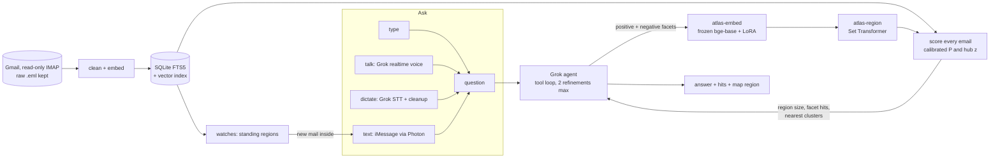

# Inbox Atlas

<div align="center">

[](https://www.python.org/)
[](https://pytorch.org/)
[](https://huggingface.co/BAAI/bge-base-en-v1.5)
[-444?style=flat-square)](https://huggingface.co/BAAI/bge-reranker-v2-m3)
[](https://docs.x.ai/)
[](https://photon.codes/)
[-003366?style=flat-square)](https://www.cs.cmu.edu/~enron/)
[](https://bigredhacks2026.devpost.com/)


</div>

Token-efficient retrieval for LLM agents over your email and your second brain. Instead of pasting whole documents or grepping file after file, an agent asks Inbox Atlas a question and gets back the few sentences that answer it, under a token budget, or a calibrated "nothing here" so it stops searching. Under the hood a question becomes a **region** of embedding space, not a keyword: Grok writes a topic list for it, the topic list becomes a region, and a calibrated score answers both "which emails or notes?" and "is this topic here at all?". People can type it, say it, or text it.

## Contents
- [Abstract](#abstract)
- [Context for agents](#context-for-agents)
  - [Navigating nested markdown](#navigating-nested-markdown)
- [Installation](#installation)
- [Method](#method)
  - [System](#system)
  - [Query to region](#query-to-region)
  - [atlas-embed: the encoder](#atlas-embed-the-encoder)
  - [atlas-region: the set to region model](#atlas-region-the-set-to-region-model)
  - [Objective](#objective)
  - [Voice and iMessage](#voice-and-imessage)
- [Results](#results)
  - [Search modes](#search-modes)
  - [Is this topic in my inbox?](#is-this-topic-in-my-inbox)
  - [Demo inbox eval](#demo-inbox-eval)
  - [Enron training and eval](#enron-training-and-eval)
- [Why this is more than RAG](#why-this-is-more-than-rag)
- [What is new and what is not](#what-is-new-and-what-is-not)
- [Repository layout](#repository-layout)
- [Reproduction](#reproduction)
- [Acknowledgements](#acknowledgements)
- [Authors](#authors)

## Abstract

Agents waste most of their context on retrieval. Ask Claude Code, Hermes or OpenClaw something about your mail or your notes and it either pastes whole documents into context or greps and opens file after file, and when the answer is not there it keeps looking. String search also misses meaning: search "coding competition" and Gmail returns the HackerRank job assessment, because it contains the word "coding", and misses the Codeforces round, the ICPC tryout and the DevPost receipt. Plain embedding search fixes recall but has no boundary: it always returns something, and on our demo inbox it ranks the job assessment first.

Inbox Atlas treats a query as a region. Grok expands the question into positive facets in the vocabulary the documents actually use plus explicit negatives ("job coding interview"). The facets and every email and note section are embedded by **atlas-embed**, a frozen `bge-base-en-v1.5` backbone with LoRA adapters (1.18M trainable parameters) trained on email with Matryoshka heads and listwise distillation from a frozen cross-encoder teacher. A hub-corrected region score ranks documents and answers "is this topic here at all?" with a yes or no. The context packer then keeps only the sentences that matter and packs them under a token budget. **atlas-region**, a Set Transformer that learns a calibrated region from the facet set, is included as an option.

Results. Agents searching by word matching miss anything phrased differently from the email: on our 12 meaning-based queries keyword search found **no relevant email for 7 of 12**, while region search found the right emails for **all 12** (Recall@10 0.867 vs 0.175, about 5x). Because one call returns the answer instead of a grep-and-open loop, the agent reads far less: the 800 token context pack averages **249 tokens**, a third of chunk RAG at the same accuracy and **18x fewer** than grep-style retrieval (4,445 tokens) while being more accurate. When the topic is not there the pack spends **31 tokens** and tells the agent to stop, where the usual approaches hand over 742 to 4,039 tokens. On a real 419 note second brain it found the right note **12 of 12** times in **625 tokens**, against 7,400 for reading whole notes (**12x fewer**). On 224,867 Enron emails our trained encoder beats the frozen base model on vague queries (nDCG@10 0.692 vs 0.635) and subject to body (0.408 vs 0.342), trained overnight on one RTX 4070 SUPER. The same tools run behind an MCP server, a Grok chat and realtime voice agent, Whisperflow-style dictation, and an iMessage agent you can text ("what do I have today?") that also texts you when new mail lands in a region you are watching. Storage is Tiger Cloud: Postgres with pgvector and a TimescaleDB query log.

## Context for agents

LLM agents (Claude Code, Hermes, OpenClaw, an Obsidian second brain) either paste whole documents into context or grep and open file after file. Inbox Atlas hands them the minimal context instead: `atlas_context(question, budget_tokens)` returns the region, the few emails or vault notes inside it, and only the sentences that answer the question, packed under a token budget, or a calibrated "nothing here" so the agent stops searching. It covers Gmail and an Obsidian vault (notes chunked by heading, embedded locally, never sent to Grok at ingest) and ships as an MCP server (`mcp/server.py`, stdio and streamable HTTP) and as `POST /api/context`. Setup for each agent: [docs/mcp.md](docs/mcp.md).


<p align="center"></p>

**Why it saves tokens.** An agent that searches by word matching has to guess the words the email used. When the email says "Codeforces Round 1043" and the question says "coding competition", grep finds nothing, so the agent rewrites the query, greps again and opens file after file. Atlas searches by meaning, so the first call lands inside the region, and it returns only the sentences that answer the question.

| | keyword / grep | Atlas |
|---|---:|---:|
| meaning-based queries with **zero** relevant hits | 7 of 12 | 0 of 12 |
| Recall@10 on those 12 queries | 0.175 | **0.867** |
| **email questions:** tokens per question | 3,724 | **225** (17x fewer) |
| **email questions:** answer accuracy | 33% | **58%** |
| context tokens per question (top 10 docs vs 800 budget pack) | 4,445 | **249** (18x fewer) |
| tokens spent when the topic is absent | 1,858 | **31** |
| real 419 note vault: tokens handed to the agent per question | 10,907 | **625** (17x fewer) |

Measured on 24 questions over the demo inbox plus a synthetic vault ([eval/token_results.md](eval/token_results.md)): the pack matches the accuracy of top-8 embedding chunks (75%) at a third of the tokens (249 vs 740) and beats grep-style top-10 documents (67% at 4,445 tokens). On 14 absent topics it abstains on 13 with about 31 tokens. On the user's real vault (embedded locally, nothing sent to Grok) the 800 token pack contained the target note for 12 of 12 questions at 625 tokens, against 7,400 for top-10 notes by embedding and 10,907 for grep.

### Navigating nested markdown

Second brains and agent workspaces (Obsidian vaults, Hermes and OpenClaw memory folders) are deep trees of markdown. Instead of querying every note, `atlas_points_of_interest(question, within=None)` embeds the tree: each folder gets the normalized mean of the section vectors under it (plus a version weighted toward its own notes), the question is scored with the same facets and hub-corrected region, and the section scores are aggregated up the tree, so a folder full of hits beats the parent that dilutes it. The agent gets the few folders the question lives in, their best notes and one excerpt each, or a 23 token "not here". `within="projects/"` drills into a subtree (folder, then subfolder, then `atlas_get` on the note), and `atlas_related_folders(path)` returns the nearest folders outside the folder's own lineage with the tags and wikilinks they share. Same over HTTP: `POST /api/context/folders`, `GET /api/context/related_folders?path=`.

On the synthetic vault (fictional notes, `base` encoder), "what pulse widths did I use for the arm servos?" returns 210 tokens:

```
1. projects/robotics/arm/ (2/2 notes, score 11.3 #robotics #arm #servo)
   - projects/robotics/arm/Servo calibration.md#pulse-widths (z 12.1)
   - projects/robotics/arm/Gripper.md#grip-force (z 7.9)
   > Elbow servo: 610 to 2380 microseconds. Wrist servo: 500 to 2450 microseconds.
2. projects/robotics/ (3/3 notes, score 10.8 #robotics #arm #rover)
   - projects/robotics/arm/Servo calibration.md#pulse-widths (z 12.1)
   - projects/robotics/arm/Gripper.md#grip-force (z 7.9)
   - projects/robotics/Rover.md#wiring-notes (z 6.4)
   > Every joint of the arm uses a hobby servo, and no two servos map pulse width to angle the same way.
```

Details: [docs/mcp.md](docs/mcp.md#navigating-a-nested-vault-by-folder).

## Installation

```bash
git clone https://github.com/xerneas3318/inbox-atlas.git && cd inbox-atlas
cp .env.example .env            # XAI_API_KEY, GMAIL_USER, GMAIL_APP_PASSWORD, SPECTRUM_*, OWNER_PHONE
uv sync --extra dev
git config core.hooksPath .githooks
```

```bash
uv run python -m atlas.ingest.load_fixture           # demo inbox, no credentials needed
uv run python -m atlas.ingest.gmail_export --max 0   # or: your whole Gmail, read-only
uv run python -m atlas.index.build --encoder base    # or --encoder models/atlas-embed
uv run python server.py                              # http://localhost:8765
```

Or run the whole backend (API, iMessage sidecar, Postgres, Gmail polling, morning brief) under one
supervisor: `uv run atlas up`, then `atlas status`, `atlas logs -f`, `atlas down`.
`atlas install-service` makes it start at login, and `atlas phone` shows how to open it on your
phone over Tailscale. See [`docs/PHONE.md`](docs/PHONE.md).

Optional pieces: `cd imessage && npm install && npm start` (iMessage agent), `uv run --extra dictate python dictate/dictate.py` (hold Right Option anywhere on macOS to dictate). See [`docs/INGEST.md`](docs/INGEST.md), [`docs/VOICE.md`](docs/VOICE.md), [`docs/IMESSAGE.md`](docs/IMESSAGE.md).

Pitch deck: [`web/deck/`](web/deck/index.html), served at http://localhost:8765/deck/ or opened straight from disk (P presenter view, N notes, F fullscreen; PDF in [`docs/deck.pdf`](docs/deck.pdf)).

Storage on Tiger Data (Postgres + pgvector, embeddings plus Grok chat history): `docker-compose up -d`, set
`DATABASE_URL`, run `uv run python -m atlas.db.migrate`. Tiger Cloud works by swapping `DATABASE_URL`. See [`docs/TIGER.md`](docs/TIGER.md).

## Method

### System



Gmail is exported read-only (the mailbox is opened with `readonly=True`, bodies are fetched with `BODY.PEEK[]`, and a wrapper raises on any mutating IMAP command). Every raw message is written to disk before parsing. Bodies are cleaned (HTML to text, quoted replies, forwarded headers and signatures stripped) and embedded locally; only top-hit snippets are sent to Grok at query time.

### Query to region

Grok writes structured facets:

```json
{"positive": ["hackathon", "Codeforces round", "ICPC regional", "LeetCode contest", "Devpost submission",
              "Kaggle competition", "programming contest", "Google Code Jam"],
 "negative": ["online coding assessment", "job coding interview", "take-home coding test"]}
```

The tool returns region statistics, not only hits: the region size, hits per facet (including facets that matched nothing) and the nearest map clusters. Grok uses them to steer: it drops facets with zero hits, narrows a region that swallowed 400 emails, and widens an empty one. That loop is capped at two refinements.

```
positive facets P (k x d), negatives N (m x d), emails E (n x d), all L2-normalized

heuristic region:   raw = 0.6 * max_k E.P_k  +  0.4 * E.c  -  1.0 * relu( max_m E.N_m - max_k E.P_k ),  c = mean(P)
learned region:     m(e) = logsumexp_k( tau_k * cos(e, a_k) ) - b,   P(member) = sigmoid( (m - shift) / T )
hub correction:     z_i = ( raw_i - mu_i(k) ) / sigma_i(k),  mu, sigma from random sets of k probe topics
related?            max z >= 3 and raw >= floor
```

Hub correction matters because newsletters and long promotional emails sit close to everything. Each email is scored against random sets of `k` probe topics (276 Grok-written everyday topics), matched to the query's facet count, so an email only counts as in the region if it stands out from what it scores against any random topic set of the same size.

### atlas-embed: the encoder

<p align="center"></p>

Gray hatched blocks are frozen, red blocks are trained. Stage A trains only the LoRA adapters; stage B freezes the whole encoder and trains only the Set Transformer.

```
email text --> [ FROZEN bge-base-en-v1.5, 110M ] + LoRA r=16 on q,k,v,o (1.18M trainable) --> CLS --> L2
                                                                                                  |
                                                    Matryoshka heads: truncate to 768 / 256 / 64, renormalize
                                                                                                  |
                       InfoNCE vs in-batch + mined hard negatives   +   KL( student || FROZEN bge-reranker-v2-m3 )
```

Training pairs, all self-supervised: Enron folder topic to member email, subject to body (rendered without its subject so the subject line is not a shortcut), reply to parent, and Grok-written abstract topics and search queries to their email. Hard negatives are mined with the base encoder; the frozen teacher doubles as a false-negative filter, so a mined candidate the teacher rates at least as relevant as the positive is never used as a negative.

### atlas-region: the set to region model

```
facet phrases (1 to 8 positive, 0 to 3 negative) --> FROZEN atlas-embed --> + type embedding (pos / neg)
        --> ISAB(16 inducing points) --> ISAB --> PMA(K=4 seeds) --> anchors a_1..a_4 (unit), tau_1..tau_4, b
```

Set augmentation (random subset sizes, phrase dropout, small embedding noise) makes it indifferent to how many facets Grok writes. After training, a temperature and an offset are fit on the validation split at the natural base rate (about 0.1 percent of emails belong to a given topic), because a temperature alone left an ECE of 0.42 on the first run.

### Objective

```
L_embed  = sum over d in {768, 256, 64} of
           InfoNCE( q_d, doc+_d ; in-batch + hard negatives, scale 20 )
         + KL( softmax(teacher scores over candidates) || softmax(student scores over candidates) )

L_region = BCE( m(e), member ; members vs nearest non-members )
         + negative-set term: emails nearest the negative phrases must score below the boundary
         + KL( teacher scores for the topic name || region scores )
```

The backbone and the teacher are frozen; only the LoRA adapters (stage A) and then the Set Transformer on cached embeddings (stage B) are trained. An optional stage C adapts the LoRA adapters to your own Gmail with Gmail labels and Grok labels as topics, split by thread.

### Voice and iMessage

- **Dictation (Whisperflow style):** hold to talk, Grok STT (`grok-voice-transcribe-2.0`) transcribes, then a short Grok pass removes fillers and applies self-corrections ("by five, no, six" becomes "by six"). About 1 second end to end. Works in the search box or, through `dictate/dictate.py`, in any macOS app.
- **Talk to your inbox:** a server-side proxy to the Grok realtime voice API with the same tools. Grok calls `search_region`, the map highlights the hits while it speaks.
- **iMessage:** a Photon Spectrum sidecar. Text it a question and it answers from your mail and calendar ("what do I have today?"). It also texts you first: a morning brief, and an alert whenever new mail falls inside a region you asked it to watch ("watch internships").

## Results

### Search modes

<p align="center"></p>

Top 8 for "coding competition" on the 24-email demo inbox with the frozen base encoder. BM25 finds one email, the job assessment, because it is the only one containing "coding". Plain cosine ranks the job assessment first. The region, with Grok's negatives, pushes it out of the top 8. The one gray email in the region list is a message from family asking about "your hackathon", which is arguably relevant.

### Is this topic in my inbox?

<p align="center"></p>

Ten topics present in the demo inbox and ten absent ones (never shown to the expansion prompt): 20 of 20 correct, with one fixed threshold across every topic. This is what lets an agent stop searching instead of reading more.

### Demo inbox eval

12 handwritten queries whose words do not appear in the target emails, a pool of the top 20 from every method, and Grok as the relevance judge (`eval/run_eval.py`, full per-query table in [`eval/results.md`](eval/results.md)). Base encoder.

| method | Recall@10 | nDCG@10 |
|---|---:|---:|
| keyword (BM25) | 0.175 | 0.217 |
| embedding (cosine) | 0.811 | 0.828 |
| region, query only | 0.839 | 0.846 |
| region, no negatives | 0.887 | 0.885 |
| region, no hub z | 0.874 | 0.880 |
| region (full) | 0.867 | 0.876 |
| hybrid (region + BM25, RRF) | 0.886 | 0.820 |

Every region variant beats single-vector cosine, and keyword search finds no relevant email at all for 7 of the 12 queries (travel plans, upcoming exams, internship hunting, stuff I bought online, workout schedule, catching up with my parents, winter break trip), because the emails never use those words. Region search finds them, with perfect nDCG@10 on 5 of those 7.

### Enron training and eval

Data after cleaning: 224,867 deduplicated emails, 426 folder topics (63 held out entirely), splits train 175,353 / val 10,817 / held-out threads 20,779 / held-out topics 17,918. 19,980 emails Grok-labeled. Teacher scores for 491k pairs. All on one RTX 4070 SUPER (stage A at 0.84 s per step, 4.2 GB with gradient checkpointing).

<p align="center"></p>

Run `a1` is a first pass without the teacher, stopped at step 2,100 to free the GPU; `a2` is the main run (one epoch, 6,148 steps, 89 minutes) with Grok topics and queries and the teacher KL term. Validation subject-to-body nDCG@10 rises from 0.44 to 0.51; validation folder-topic nDCG@10 stays flat near 0.14.

<p align="center"></p>

nDCG@10 on unseen emails (`train/eval.py`, `runs/eval2`):

| task | BM25 | base bge | atlas-embed 768 | atlas-embed 256 |
|---|---:|---:|---:|---:|
| subject to body, held-out threads | 0.388 | 0.342 | **0.408** | 0.381 |
| Grok vague query to email | 0.652 | 0.635 | **0.692** | 0.659 |

On the tasks that need meaning rather than shared words, atlas-embed is the best system, ahead of both BM25 and the frozen base model, and at 256 dims (a third of the storage) it still beats the base model.

Region membership on held-out folders (`runs/eval3`):

| region | AUROC | ECE, top 200 per topic |
|---|---:|---:|
| heuristic on base bge | 0.819 | 0.065 |
| heuristic on atlas-embed | **0.843** | 0.055 |
| learned region (atlas-region) | 0.841 | **0.046** |

The trained encoder lifts region membership AUROC from 0.819 to 0.843 on topics it never saw, and the learned region gives the best calibrated probabilities (ECE 0.046). Full details and the student ablations are in [`TRAINING.md`](TRAINING.md).

## Why this is more than RAG

<p align="center"></p>

Standard RAG embeds the question, takes the top k chunks and pastes them in. It always returns something, it treats the question as one point, and it hands over whole chunks. Inbox Atlas changes each of those, and each change is measured against chunk RAG or a single query vector on the same data:

1. **It knows when nothing is there.** Every document is scored against random topic sets with the same number of facets, so a high score has to stand out from chance. The result is a calibrated yes or no that tells the agent to stop: 31 tokens on absent topics instead of 742 for chunk RAG, abstaining on 13 of 14.
2. **A question is a region, not a point.** Grok writes facets and exclusions, so "coding competition" pulls in Codeforces, ICPC and DevPost and pushes out the HackerRank job test that a single query vector ranks first.
3. **It returns sentences under a budget, not chunks.** Same 75% accuracy as chunk RAG at 249 tokens instead of 740.
4. **It navigates folders before notes.** Folder vectors over a markdown tree find where a question lives, then drill down: 210 tokens to the folder, the note and the exact line.
5. **Its encoder is trained for mail.** A frozen bge backbone with LoRA, distilled from a frozen teacher, beats the base model on vague queries (nDCG@10 0.692 vs 0.635).

## What is new and what is not

| piece | status |
|---|---|
| Semantic search over email | Not new. Gmail with Gemini, Shortwave and Superhuman all ship AI search. |
| LLM query expansion | Not new. HyDE (Gao et al. 2022), Query2doc (Wang et al. 2023). |
| Training a retriever on LLM-written queries | Not new. GPL, InPars, Promptagator. |
| LoRA, Matryoshka, cross-encoder distillation | Not new. Hu et al. 2021, Kusupati et al. 2022, RocketQAv2 and margin-MSE. |
| Queries as regions | Known idea in knowledge-graph reasoning: Query2Box (Ren et al. 2020), BetaE. Hubness correction: CSLS (Lample et al. 2018). |
| **Token-budgeted context packs with abstention** | Ours as a system: region, sentence-level extraction and a calibrated "nothing here" behind one MCP tool, measured in tokens per correct answer against grep, chunk RAG and whole-document RAG. |
| **Learned set-to-region encoder over LLM facets** | Ours: a Set Transformer that turns an LLM's facet list into a calibrated region (ECE 0.046 on held-out topics). |
| **Calibrated "is this topic in my inbox at all?"** | Ours as a product feature: a yes/no with confidence from per-email, facet-count-matched hub z-scores. |
| **Agentic region steering** | Ours as a design: the tool returns region geometry so the LLM can widen, narrow and exclude like moving a map. |
| **Zero-shot transfer probe** | A model trained only on 2001 corporate Enron mail, applied to a 2026 student's Gmail it never saw (`train/build_personal.py`). |

In short, the components have prior art. The contribution is the system that turns them into a token-budgeted, calibrated context tool for people and agents, with measured token savings.

## Repository layout

| path | contents |
|---|---|
| `atlas/ingest/` | read-only Gmail IMAP export (`imap.py`, `gmail_export.py`), cleaning, incremental `sync.py`, fixture loader |
| `atlas/index/` | embedding index, probe topics and hub statistics, UMAP + HDBSCAN map with Grok cluster labels |
| `atlas/search/` | `region.py` (Region interface, heuristic region, hub z, related?), `hybrid.py` (BM25, cosine, region, RRF) |
| `atlas/db/` | Tiger Data backend: `schema.sql`, `pg.py` (pgvector HNSW knn, tsvector FTS, chat history), `backend.py` switch, `migrate.py` |
| `atlas/agent/` | Grok facet expansion, tool schemas, tool loop with region feedback, watches |
| `atlas/model/` | `encoder.py` loader, `trained.py` (LoRA checkpoint), `region_encoder.py` (Set Transformer) |
| `atlas/voice/` | Grok STT, dictation cleanup, realtime voice proxy |
| `atlas/notify.py`, `imessage/` | morning brief and watch alerts, Photon Spectrum sidecar (Node) |
| `atlas/calendar.py` | Google Calendar iCal sync and date mentions in email for "what do I have today" |
| `train/` | Enron parser, Grok labeler, miner, teacher scoring, stage A and B trainers, eval, ablation scripts |
| `web/` | single page UI: search, facets, related badge, results, inbox map, voice |
| `dictate/dictate.py` | system-wide hold-to-talk dictation for macOS |
| `eval/` | demo inbox eval with Grok as judge |
| `scripts/make_figures.py` | every figure in this README, rendered from logs and the live API |
| [`PLAN.md`](PLAN.md), [`CONTRACT.md`](CONTRACT.md), [`TRAINING.md`](TRAINING.md) | design, interfaces between modules, training runbook |

## Reproduction

```bash
uv sync --extra dev && ATLAS_ENCODER=hash uv run pytest -q    # offline suite, no keys needed
uv run pytest -q -m slow                                       # real encoder on the demo inbox
cd imessage && npm install && npm test                         # iMessage sidecar
```

Training (one 12 GB GPU, full runbook with timings in [`TRAINING.md`](TRAINING.md)):

```bash
uv sync --extra train
uv run python -m train.enron --download                        # 2 min
uv run python -m train.grok_label --cap 20000                  # 18 min, network bound
uv run python -m train.mine --ds enron                         # 6 min
uv run python -m train.teacher --ds enron                      # 36 min
uv run python -m train.stage_a --run a2 --out models/atlas-embed   # about 90 min
uv run python -m train.stage_b --model models/atlas-embed --run b1 # about 15 min
uv run python -m train.eval --run eval2 --models models/atlas-embed
uv run --extra figures python scripts/make_figures.py --runs runs
```

## Acknowledgements

Enron email corpus (CMU, William Cohen). BAAI `bge-base-en-v1.5` and `bge-reranker-v2-m3`. Set Transformer (Lee et al. 2019). xAI Grok (chat, speech to text, realtime voice). Photon Spectrum. Built at BigRed//Hacks 2026, Cornell University, theme "Navigation".

## Authors

Avinash Senthil, Antranig Baghdassarian, Chelsea Lin, Emily Han.
